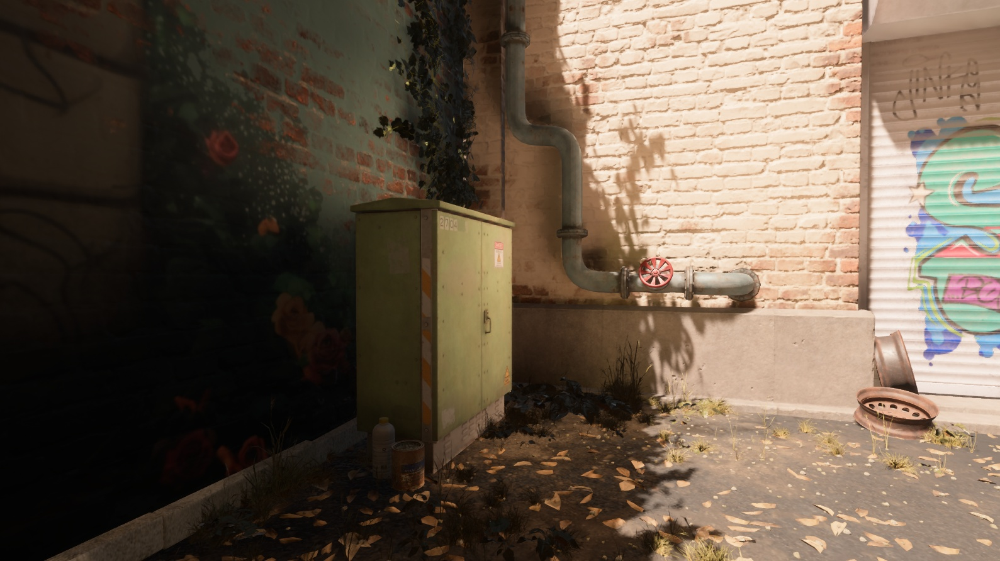

# Bevy Ridiculous SSGI

Very experimental - WIP

There will be a lot of changes over time that could ruin a specific look in scenes that were depending on this plugin. For consistency, It's recommended to depend on a specifc commit.

- Supports WebGL2
- Currently only supports deferred rendering

Note: SSGI can be very finicky due to depending on gathering light information from what's avaliable on screen. It's usefulness will be scene dependant. Some scenes can benifit from supplementing with an environment map or similar.

Note this depends on bevy-inspector-egui (for InspectorOptions on SSGI related components) which causes a ICE on rust stable 1.74, for a workaround you can use nightly or beta instead.
https://github.com/jakobhellermann/bevy-inspector-egui/issues/153

